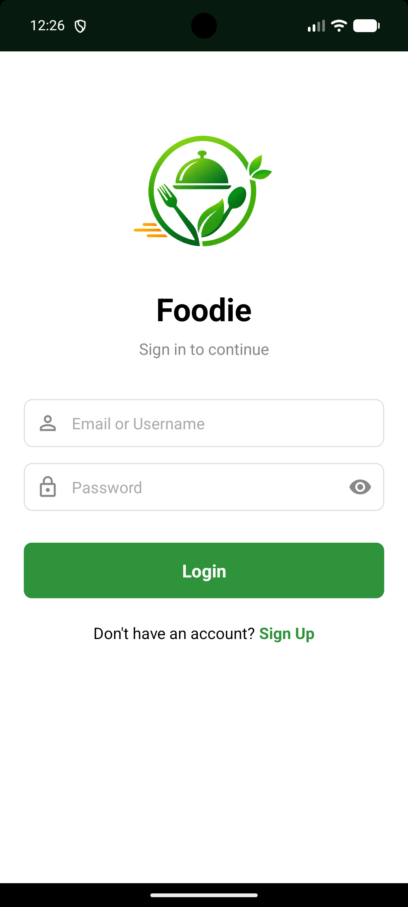
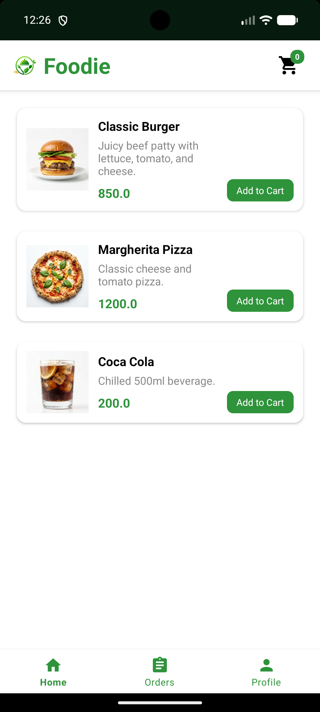
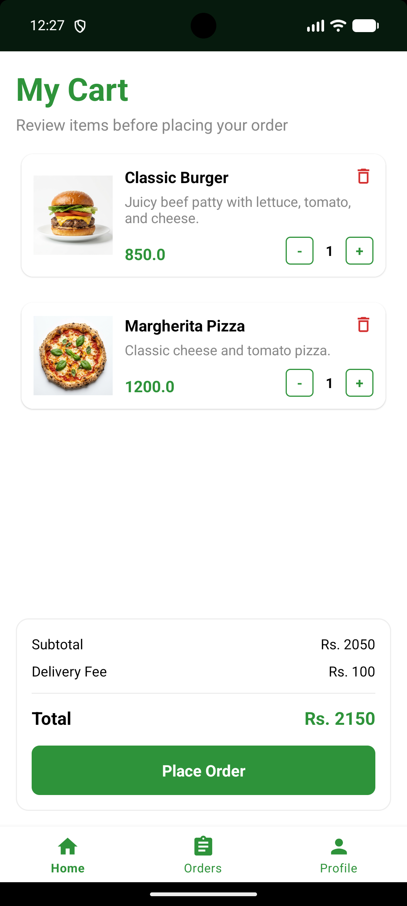
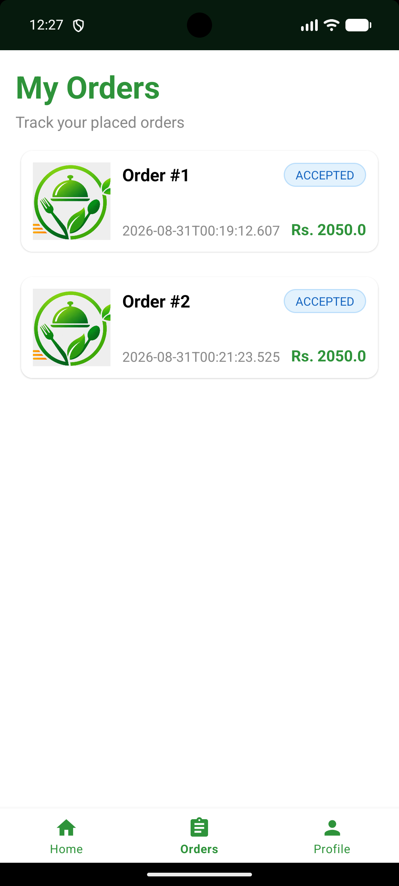
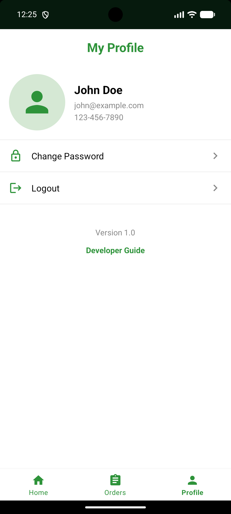
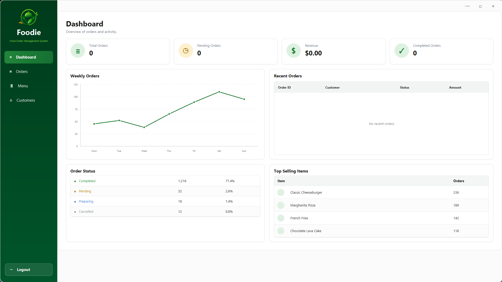
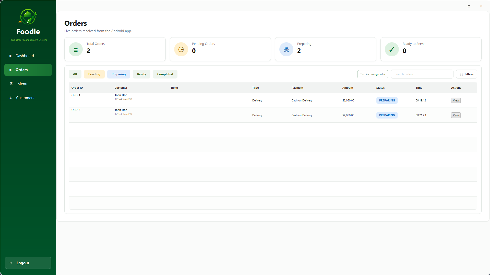
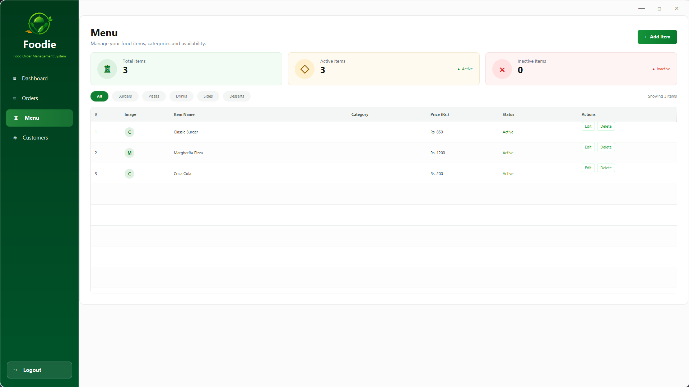
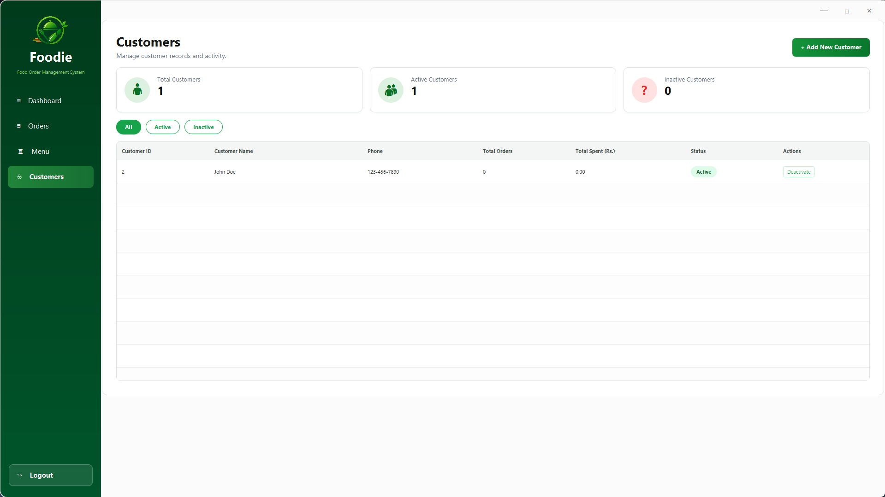
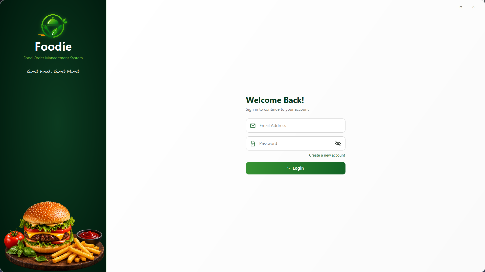

<div align="center">
  
  <h1>Foodie / Food Ordering Management System (FOMS)</h1>
  <p>A university OOAD project with an Android customer app, JavaFX admin desktop app, Spring Boot API, and SQLite database.</p>
</div>

## 📌 Project Background
This project was originally created as a university Object-Oriented Analysis and Design (OOAD) group project at FAST NUCES in 2019. It was later reconstructed and revived from preserved artifacts and requirements to demonstrate a complete full-stack architecture.

## ✨ Core Functionality
**Customer (Android App)**
- Signup / login
- Browse menu
- Manage cart
- Place order
- View order history and status

**Admin (JavaFX Dashboard)**
- View admin dashboard metrics
- Manage menu items (`FoodItem`)
- Receive live orders from the Android app
- Accept, reject, or update order statuses
- View registered customers

## 🏗 System Architecture
The Android app and JavaFX desktop app communicate with a Spring Boot REST API over HTTP/JSON. The API handles authentication, menu, cart, and order operations and persists data in SQLite through Spring Data JPA.


## 🔄 Order Flow
The core business workflow connects both clients through the centralized backend:
**Customer adds items to cart → places order from Android → Spring Boot stores order → JavaFX fetches new order → admin accepts/rejects or changes status → updated order state becomes visible to the customer.**


## 🗄 Database Design
The system's database schema revolves around five main entities:
- `User`: Handles both Customers and Admins.
- `FoodItem`: Represents the restaurant menu offerings.
- `CartItem`: Links customers to items before checkout.
- `Order`: The primary transaction record.
- `OrderItem`: The specific items and quantities inside an order.


## 📐 OOAD / Design Artifacts
The project documentation includes comprehensive diagrams derived directly from the implementation, such as the Architecture, ERD, and Sequence diagrams above, alongside structural Use Case models.


## 💻 Technology Stack
- **Languages:** Java
- **Desktop Client:** JavaFX / FXML
- **Mobile Client:** Native Android Java / XML
- **Backend:** Spring Boot, Spring Data JPA
- **Database:** SQLite
- **Architecture:** REST / JSON API
- **Build Tools:** Maven / Gradle

## 📂 Project Structure
```text
FOMS/
├── Foodie - Andriod/     # Android customer app
├── Foodie - Javafxml/    # JavaFX admin desktop app
├── Foodie - Api/         # Spring Boot backend API
├── media/                # Assets and screenshots
└── README.md
```

## 🚀 How to Run Locally

### 1. Start the Backend (`Foodie - Api`)
- Open the backend project in IntelliJ IDEA or Eclipse.
- Ensure Java 17+ is installed.
- Run `FoodieApiApplication.java`. The server starts on port `8081` connected to the local SQLite database.

### 2. Launch the Desktop Dashboard (`Foodie - Javafxml`)
- Open the JavaFX project in your IDE.
- Build via Maven (`mvn clean install`) to resolve dependencies.
- Run the application. Log in using the test admin credentials.

### 3. Run the Android App (`Foodie - Andriod`)
- Open the project in Android Studio and sync Gradle files.
- Update the API base URL in the app's networking client to point to your local machine's IPv4 address (e.g., `http://192.168.x.x:8081`). *Do not use `localhost` if running on a physical device or emulator.*
- Build and run on a physical device or emulator.

**Demo Credentials**
- **Admin (JavaFX):** `admin@foodie.com` / `admin123`
- **Customer (App):** `john@example.com` / `password123`

---

## 📸 Screenshots / Demo

### Android App (Customer)
| Splash Screen | Login | Menu |
| :---: | :---: | :---: |
|  |  |  |

| Cart | My Orders | Profile |
| :---: | :---: | :---: |
|  |  |  |

### JavaFX Admin Dashboard
| Dashboard Overview |
| :---: |
|  |

| Orders Management | Menu Management |
| :---: | :---: |
|  |  |

| Customers | Login |
| :---: | :---: |
|  |  |

---

## 👥 Original Team & Credits
This project was initially conceptualized and developed by the original OOAD student group at FAST NUCES (2019). Proper credit goes to the following original team members for the system's foundational requirements and vision:

- **Mubeen Ghauri** 
- **Rohan Farooqi** 
- **Haris Noori** 
- **Huzaifa Afridi** 
- **Aamir Ahmad Khan** 
- **Bilal Rahim** 

## 🔄 Revival Note
This repository is a reconstructed edition of the original academic project. The original project concept, requirements, architecture, and team contributions date back to the university project period, while the current codebase was rebuilt from preserved artifacts for demonstration and preservation.

## 🎓 Academic Disclaimer
This project was developed for educational purposes as part of an Object-Oriented Analysis and Design course.

Original Academic Project: 2019
Project Revival / Reconstruction: 2026
